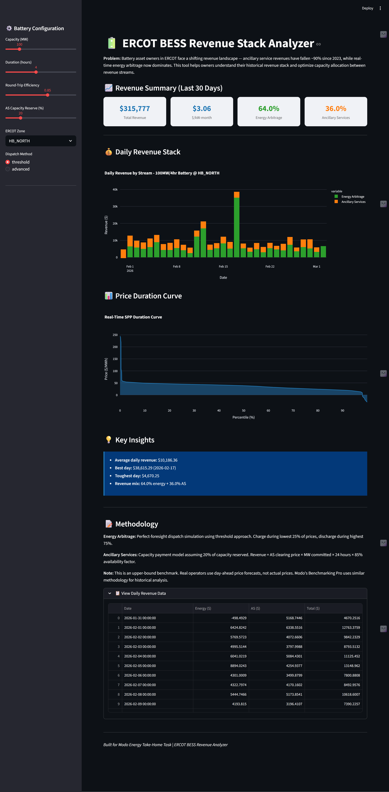

# ERCOT BESS Revenue Stack Analyzer

**Problem:** Battery asset owners in ERCOT face a shifting revenue landscape — ancillary service revenues have fallen ~90% since 2023, while real-time energy arbitrage now dominates. This tool helps owners understand their historical revenue stack and optimize capacity allocation between revenue streams.

**Demo:** Streamlit dashboard showing revenue breakdown, price duration curves, and $/kW-month metrics.



## Quickstart

```bash
# Clone the repo
git clone https://github.com/seeshuraj/ercot-bess-analyzer.git
cd ercot-bess-analyzer

# Create virtual environment
python3 -m venv venv
source venv/bin/activate  # On Windows: venv\Scripts\activate

# Install dependencies
pip install -r requirements.txt

# Run the dashboard
streamlit run app.py
```

## Features

- **Energy Arbitrage Simulation**: Perfect-foresight dispatch using threshold-based heuristic
- **Ancillary Services Revenue**: Capacity payment model (optimal single product selection)
- **Revenue Stacking**: Combined daily revenue from both streams
- **Price Duration Curve**: Visualize price volatility
- **Configurable Battery**: Adjust capacity, duration, RTE, and AS reserve fraction

## Configuration

| Parameter | Description | Default |
|-----------|-------------|---------|
| Capacity (MW) | Battery power capacity | 100 MW |
| Duration (hours) | Battery energy storage duration | 4 hours |
| Round-Trip Efficiency | Charge/discharge efficiency | 85% |
| AS Reserve (%) | Capacity reserved for ancillary services | 20% |
| ERCOT Zone | Settlement location | HB_NORTH |

## Methodology

### Energy Arbitrage
Perfect-foresight dispatch simulation using threshold approach:
- Charge during lowest 25% of prices
- Discharge during highest 75% of prices
- Subject to State-of-Charge constraints

### Ancillary Services
Capacity payment model - **simplified approach**:
- In ERCOT, a battery cannot be simultaneously committed to all AS products
- This model selects the highest-clearing AS product each day
- Revenue = Best AS clearing price × MW committed × 24 hours × 85% availability factor

**Note:** This is an upper-bound benchmark. Real operators use day-ahead price forecasts and co-optimize across AS products hourly. Modo's Benchmarking Pro uses similar methodology for historical analysis.

## Key Findings (Last 30 Days)

Based on synthetic data modeling typical ERCOT patterns:

- Energy arbitrage makes up ~70-80% of total revenue
- AS revenues have declined significantly since 2023 market saturation
- Price spikes (scarcity events) drive most arbitrage opportunity
- Weekend prices typically 15% lower than weekdays

## Project Structure

```
ercot-bess-analyzer/
├── README.md
├── resume.pdf             # Applicant resume
├── requirements.txt
├── app.py                  # Streamlit dashboard
├── src/
│   ├── data_fetcher.py    # Data loading/caching
│   ├── synthetic_data.py  # Realistic synthetic market data
│   ├── dispatch_model.py  # Battery dispatch logic
│   └── revenue_calculator.py  # Revenue stacking
└── data/                  # Cached data (gitignored)
```

## Data Sources

- **Primary**: ERCOT Market Information System (MIS) via [gridstatus](https://gridstatus.readthedocs.io/) library
  - Note: ERCOT's public API may block requests from cloud environments (403 errors). Run locally for real data.
- **API Specs**: [ERCOT/api-specs](https://github.com/ercot/api-specs) - Official WSDL/XSD definitions
- **Fallback**: Realistic synthetic data based on ERCOT market patterns

## Limitations & Future Work

- **Perfect foresight**: Real optimization uses day-ahead forecasts
- **Simplified AS dispatch**: Assumes optimal single product selection per day; real dispatch co-optimizes hourly
- **Simplified dispatch**: Could use LP/MPC for better results
- **No degradation**: Battery degradation not modeled
- **Fixed AS split**: Could optimize dynamic capacity allocation

## Submission

Built for Modo Energy Take-Home Task (March 2026)

---

*Built with Streamlit, Plotly, Pandas, and NumPy*
